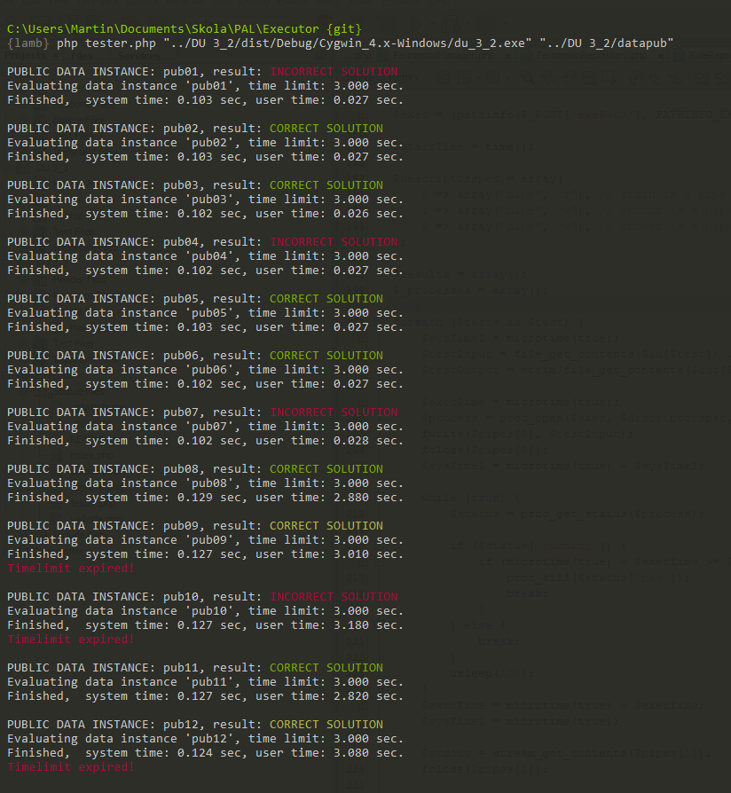

# PAL-Tester
Jednoduchá utilitka pro rychlé testování domacích úkolů z předmětu ALG / PAL (ČVUT).

## Požadavky
Pro používání je potřeba mít nainstalovaný PHP interpreter / PHP Apache.

## Testování úloh
Program se spouší příkazem:

`# php tester.php programPath testpubDir`

Dále je možné pomocí přepínače `--time` nastavit time-limit úloh (defaultně 3 sekundy  / úloha), nebo pomocí přepínače `--verbose` zapnout tisk výstupu vašeho programu do terminálu. V ne-verbose módu bude tištěn pouze `stderr` pokud nebude prázdný.

Nově jsem pak implementoval switch `--watch`, který skript po dokončení testů neukončí, ale bude sledovat mtime (času poslední modifikace exe / jar souboru) a při jeho změně (re-kompilaci programu) spustí všechny testy znovu. 

Rovněž je k dispozici nově přepínač `--strict`, který vypne kanonizaci výstupu vašeho programu, která defaultně nahrazuje konce řádku, které odpovídají výrazu "( )*[\n\r]+" za znak EOL a na konci výstupu případně odstraní prázdné řádky.

## Použití v prohlížeči
Jelikož je skript napsán v jazyce PHP, je možné jej zkombinovat s PHP Apache a spouštět / zobrazit výsledky v prohlížeči. Cestu k aplikaci a testovacím datům a zvolení časového limitu je pak možné určit ve formuláři v záhlaví stránky.

